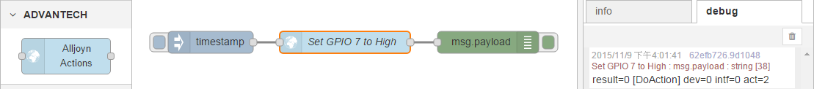
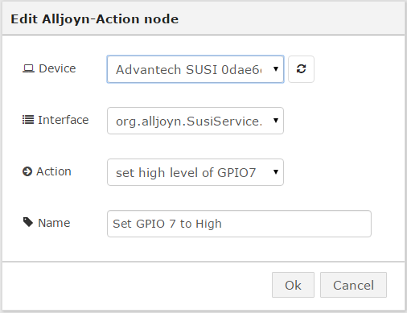

# node-red-contrib-alljoyn
A collection of [Node-RED](http://nodered.org) nodes to access Alljoyn services by [node-alljoyn](https://www.npmjs.com/package/node-alljoyn).

## Install
Use npm to command to install this package locally in the Node-RED modules directory
```bash
$ npm install node-red-contrib-alljoyn
```
or install in it globally with the command
```bash
$ npm install node-red-contrib-alljoyn -g
```

## Nodes included in the package
**Alljoyn-Action** Get action descriptions from any Alljoyn services and perform action via remote call.

### Usage example
Add "Alljoyn Actions" to your flow and it can perform the specific "Action" for you.  


To browse and select Alljoyn Actions from your proximal networks.
If no Alljoyn service is found, you can try to "Refresh" agian.  


## History
- v0.1.0 - Nov 2015 : Support "Alljoyn Action" function

## License
Copyright 2015 ADVANTECH Corp. under [the Apache 2.0 license](LICENSE).
